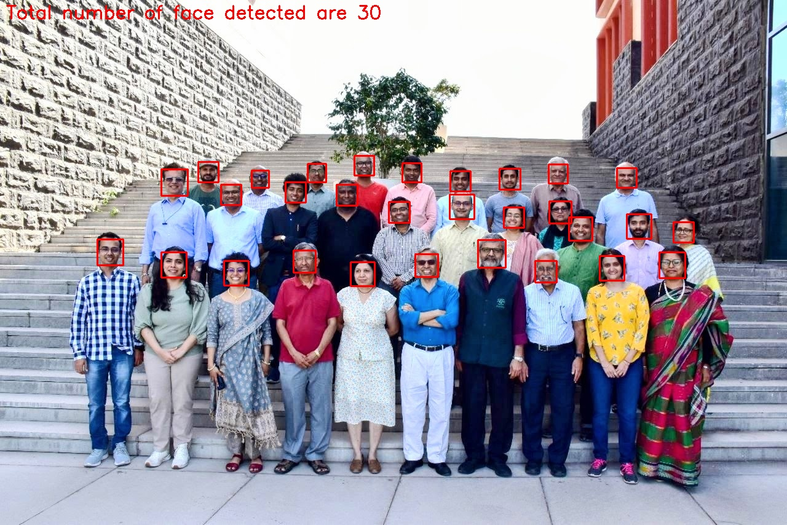
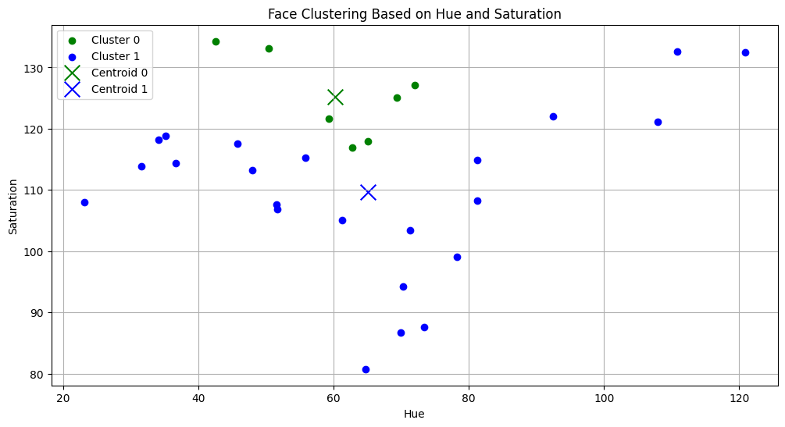
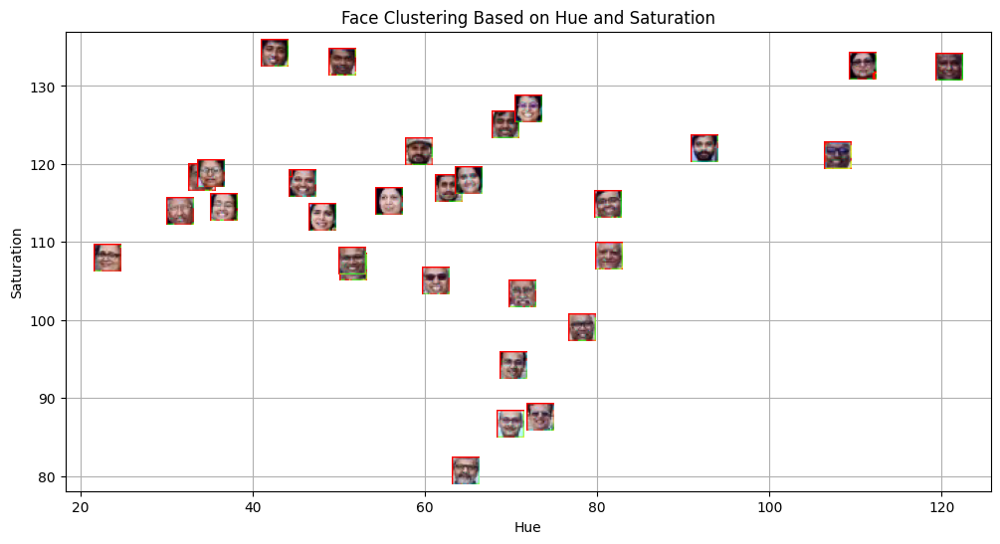
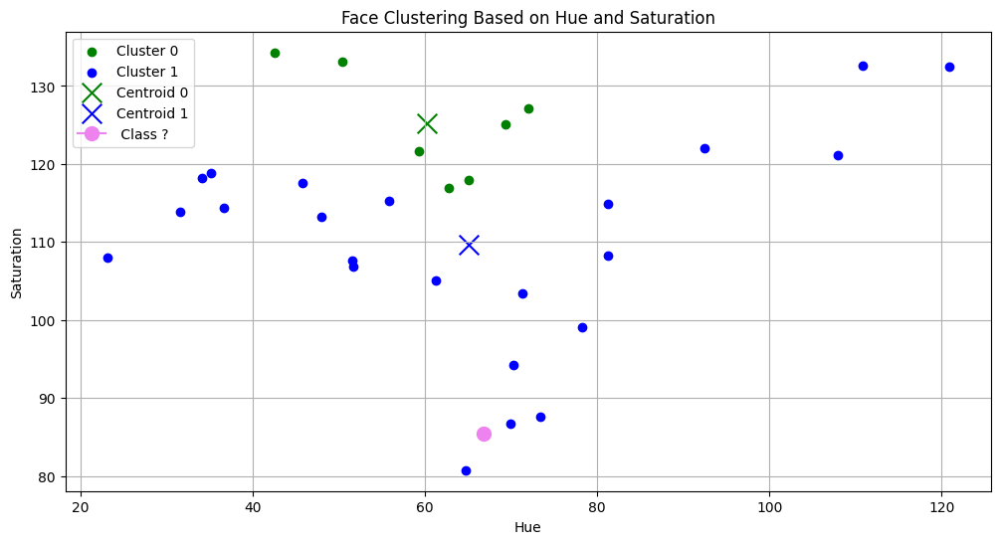
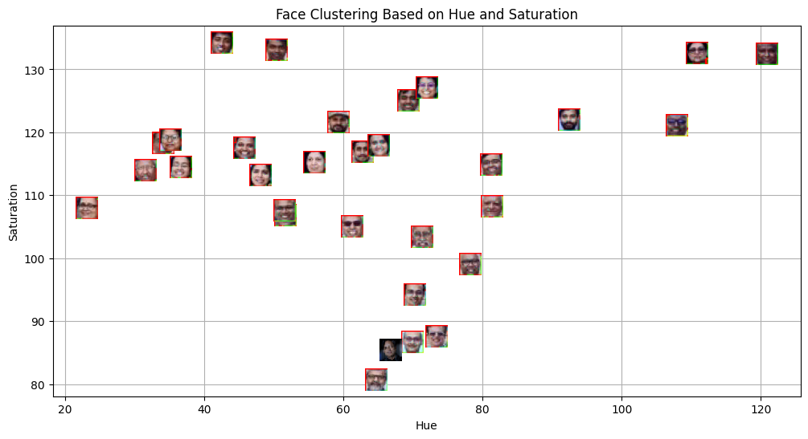

# Face Detection and Clustering using K-Means

##  Overview

This lab file performs face detection on a group image and clusters the detected faces using HSV color features. K-Means clustering is applied to group similar faces based on Hue and Saturation values.

##  Aim

- Detect faces using Haar Cascade.
- Extract Hue and Saturation features from detected faces.
- Apply K-Means clustering.
- Classify a template face into a cluster.
- Visualize clustering results clearly.

---

##  Methodology

### 1 Face Detection
- Converted input image to grayscale.
- Used Haar Cascade classifier for face detection.
- Drew bounding boxes around detected faces.

### 2️ Feature Extraction
- Converted face regions to HSV color space.

### 3️ Clustering
- Applied K-Means with:
- Grouped faces based on HSV similarity.

### 4️ Template Classification
- Used trained K-Means model to predict cluster label.

### 5️ Visualization
- Scatter plot of Hue vs Saturation.
- Different colors for clusters.
- Grouped faces based on HSV similarity.

### 4️ Template Classification
- Extracted HSV features from template image.
- Used trained K-Means model to predict cluster label.

### 5️ Visualization
- Scatter plot of Hue vs Saturation.
- Different colors for clusters.
- Centroids highlighted.
- Template image plotted in feature space.

---
##  Key Findings

- HSV color features provide meaningful separation between faces.
- K-Means successfully clusters faces based on similarity.
- Template image classification works using cluster centroids.
- Visualization helps interpret clustering results clearly.
---
##  Conclusion

This lab file demonstrates how unsupervised learning techniques like K-Means can cluster image data using simple color based features. It highlights the importance of feature extraction, distance metrics, and visualization in understanding data patterns.

##  Results

### Face Detection Output

### image plaksha_Faculty.jpg

 

---

## image Dr_Shashi_Tharoor
 

